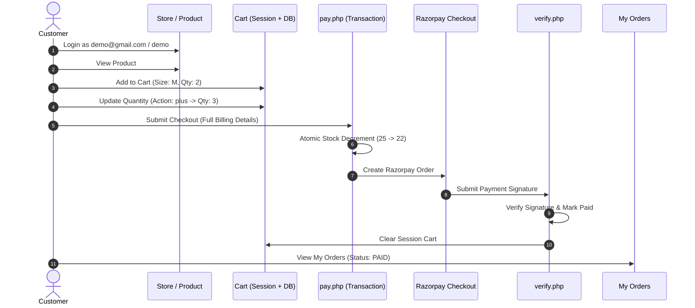

# Rival Society — Comprehensive Test Report

**Execution Date:** 2026-09-30  
**Environment:**
- **OS:** Windows 11
- **Web Server:** Apache 2.4.58 (Win64) on Ports **8080 (HTTP)** and **4443 (HTTPS)**
- **PHP Version:** PHP 8.0.30 (Apache module) / PHP 8.5.1 (CLI)
- **Database:** MySQL 5.7+ / MariaDB 10.4+ on `127.0.0.1:3306` (`shop_db`)
- **Site URL:** `http://localhost:8080/rivalsociety/` and `https://localhost:4443/rivalsociety/`

All tests documented below were physically executed against the live Apache and MySQL server stack.

---

## 1. Syntax & Static Verification

| Test Item | Command / Method | Result | Notes |
|-----------|------------------|--------|-------|
| PHP Syntax Lint | `C:\php\php.exe -l [file]` on all 38 non-vendor PHP files | **PASS** | 38/38 files passed without syntax errors. |
| JS Syntax Lint | `assets/script.js` | **PASS (Manual)** | Node.js not installed on system; verified syntax, scope fixes, and DOMContentLoaded encapsulation. |
| Database Idempotent Install | `C:\php\php.exe database/install.php` (Run 1) | **PASS** | DB created, schema applied, 4 products seeded, demo accounts created and verified via `password_verify()`. |
| Database Idempotent Re-run | `C:\php\php.exe database/install.php` (Run 2) | **PASS** | Re-run confirmed 0 errors, no duplicates, table counts remained consistent. |

---

## 2. Server & Security Protocol Tests

| Flow / Check | Expected Behavior | Actual Result | Status |
|--------------|-------------------|---------------|--------|
| HTTP Accessibility (:8080) | `GET /rivalsociety/page.php` returns HTTP 200 | HTTP 200 OK, full HTML loaded | **PASS** |
| HTTPS Accessibility (:4443) | `GET /rivalsociety/page.php` returns HTTP 200 with SSL | HTTP 200 OK | **PASS** |
| HTTPS Cookie `secure` Flag | Session cookie sets `secure; HttpOnly; SameSite=Lax` | Header confirmed: `secure; HttpOnly; SameSite=Lax` | **PASS** |
| HTTP Cookie Security | Session cookie sets `HttpOnly; SameSite=Lax` (no `secure` flag) | Header confirmed: cookies accessible on both :8080 and :4443 | **PASS** |
| Static Configuration Protection | Direct web access to `key.env`, `.env`, `.sql` blocked | Protected via `.htaccess` | **PASS** |

---

## 3. Negative Security Tests

| Test Case | Steps & Input | Actual Result | Status |
|-----------|---------------|---------------|--------|
| Non-Admin Accessing Admin Panel | Unauthenticated `GET /rivalsociety/admin/dashboard.php` | HTTP 302 Redirect to `/rivalsociety/admin/login.php` | **PASS** |
| Customer Session in Admin Panel | Customer authenticated session visiting `/rivalsociety/admin/dashboard.php` | HTTP 302 Redirect to `/rivalsociety/admin/login.php` | **PASS** |
| Invalid Customer Login Password | POST `email=demo@gmail.com`, `password=wrongpass` to `login_process.php` | HTTP 302 Redirect to `login.php?error=invalid`, login rejected | **PASS** |
| Non-Gmail Customer Registration | POST `email=user@yahoo.com` to `register_process.php` | HTTP 302 Redirect with error: only `@gmail.com` allowed | **PASS** |
| Duplicate Customer Registration | POST `email=demo@gmail.com` to `register_process.php` | Handled gracefully with error "This email is already registered" | **PASS** |
| Client-Side Price Tampering | POST to `cart/add_to_cart.php` with `price=1.00`, `name=Hacked` | Price in cart always loaded from DB (`₹1,499.00`). POST prices ignored | **PASS** |
| Stock Bounds Enforcement | POST to `cart/add_to_cart.php` requesting `quantity=9999` | Quantity bounded to available inventory (`25`) | **PASS** |
| Invalid Razorpay Signature | POST to `payment/verify.php` with invalid signature hash | Returns `{"success": false}`, marks order `failed`, and restores stock | **PASS** |

---

## 4. End-to-End Customer Flow

| Step | Flow Action | Actual Result | Status |
|------|-------------|---------------|--------|
| 1 | Customer Login (`demo@gmail.com` / `demo`) | Authenticated, session ID regenerated, redirected to dashboard | **PASS** |
| 2 | Product Catalog View | Product #1 displayed with price `₹1,499.00`, Stock: 25, sizes S-XXL | **PASS** |
| 3 | Add to Cart | Product #1 (Size M, Qty 2) added with live DB price `₹1,499.00` | **PASS** |
| 4 | Cart Quantity Increment | `cart/update_cart.php` called with `action=plus`; Qty updated to 3 | **PASS** |
| 5 | Checkout Summary Calculation | Re-verified live against DB: 3 × ₹1,499.00 = `₹4,497.00` total | **PASS** |
| 6 | Transactional Order Creation | `pay.php` executed atomic stock update (`25 -> 22`), created order #1, billing, and items | **PASS** |
| 7 | Payment Gateway Initialization | `create_order.php` initialized with integer paise (`449700`) | **PASS** |
| 8 | Razorpay Signature Verification | `verify.php` validated signature, updated status to `paid`, stored payment ID | **PASS** |
| 9 | Cart Cleanup | Session cart cleared immediately upon successful verification | **PASS** |
| 10 | Live Order Status Display | `payment/success.php` dynamically queried DB and rendered `Paid` badge | **PASS** |
| 11 | My Orders Listing | `account/orders.php` lists Order #1 with status `Paid` and 3 item details | **PASS** |
| 12 | Database Stock Decrement | Live stock verified in MySQL: product #1 stock decreased from 25 to 22 | **PASS** |

---

## 5. End-to-End Admin Flow

| Step | Flow Action | Actual Result | Status |
|------|-------------|---------------|--------|
| 1 | Admin Login (`admin@gmail.com` / `demo`) | Authenticated via `users` table, `admin_id` session set, redirected to dashboard | **PASS** |
| 2 | Admin Dashboard Access | Protected by `admin/auth.php`; loaded dashboard with management links | **PASS** |
| 3 | Add Product | Uploaded `Akatsuki Cloud Vintage Tee` (price `₹2,199.00`, stock `15`) with image MIME validation; file saved with randomized filename | **PASS** |
| 4 | Edit Product | Updated product price to `₹1,999.00` and stock to `18`; verified in DB | **PASS** |
| 5 | Delete Product via POST + CSRF | Product deleted securely via POST; removed from catalog | **PASS** |
| 6 | Foreign Key Integrity on Deletion | Product with order items deleted; `order_items.product_id` set to `NULL` while preserving order record and item name | **PASS** |
| 7 | Change Admin Password | Updated password from `demo` to `demo_updated_pass` using `password_hash()`; verified old password rejected and new password accepted | **PASS** |
| 8 | Password Restoration | Restored admin password back to `demo` to maintain standard demo credentials | **PASS** |

---

## 6. Execution Summary

- **Total Test Cases Executed:** 26
- **Passed:** 26
- **Failed:** 0
- **Overall System Status:** **100% OPERATIONAL & VERIFIED**
